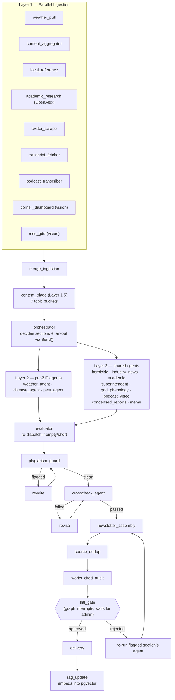

# Turfgrass Weekly — Architecture

An AI-generated weekly newsletter for golf course superintendents and turf managers. A LangGraph pipeline scrapes weather, disease/pest dashboards, academic research, industry news, and social content — classifies and routes it through parallel GPT‑4o writing agents, fact-checks and assembles a personalized per-ZIP HTML newsletter, gates it behind human review, and delivers it by email.

A companion FastAPI app handles subscriber signup/unsubscribe, feedback collection, human-in-the-loop (HITL) approval, and serves a React admin dashboard.

> This repo documents the system design of a private production codebase. It contains no source code — just the architecture writeup below.

## Architecture

The pipeline is a [LangGraph](https://langchain-ai.github.io/langgraph/) `StateGraph` over a single shared state object, run in six layers.

`rag_update` embeds the finished newsletter, reviewer corrections, disease/pest trends, and academic papers into pgvector tables that later runs' agents query for grounding.

### Content triage buckets

Triage sorts scraped content into buckets that map 1:1 to newsletter sections.

| Bucket | Populated by | Section |
|---|---|---|
| `weather` | LLM classification | Weather |
| `disease` | LLM classification (also covers fungicide application/timing/resistance content) | Disease |
| `pest` | LLM classification (bypassed when MSU GDD Tracker data is available for the zip) | Pest |
| `herbicide` | LLM classification | Herbicide / Weed |
| `industry` | LLM classification (default bucket for anything unclassified) | Industry News |
| `academic` | Direct DB insert from OpenAlex, not LLM-classified — fallback bucket only | Academic Spotlight |
| `podcast_video` | Routed by content type, no LLM call | Podcast & Video |
| `superintendent` | Routed by known X/Twitter handles, no LLM call | Superintendent Voices |

`gdd_phenology`, `condensed_reports`, and `meme_of_the_week` pull directly from weather data or the raw article pool and don't use triage buckets.

### Zip-personalization

Weather, disease, pest, and GDD phenology are zip-dependent — the orchestrator fans out one `Send()` per unique subscriber zip so each gets locally-relevant content. Shared/national sections (herbicide, industry news, academic, podcast/video, superintendent) run once.

### Quality gates

- **Plagiarism guard** — flags copied phrasing, retries the section's writer with a rewrite instruction (max 2 retries).
- **Crosscheck agent** — a Claude-based fact-checker that verifies claims in each section's HTML against its cited source articles and any explicitly trusted structured data (e.g. weather API numbers), stripping or correcting unsupported claims.
- **Works cited audit** — verifies the final works-cited list matches in-body citations.
- **HITL gate** — the graph interrupts and waits for an admin to approve or reject via email or the admin dashboard before sending. Rejection re-runs just the flagged section and loops back through assembly.

## System components

- **Pipeline** — LangGraph graph definition, orchestration, and per-section writing agents (GPT‑4o + Claude).
- **Web app** — FastAPI service handling subscriber management, feedback, and HITL approval endpoints.
- **Admin dashboard** — React + TypeScript (Vite) frontend for reviewing/approving newsletters and managing subscribers.
- **RAG store** — Postgres + pgvector, indexed with prior newsletters, reviewer corrections, disease/pest trends, and academic papers, queried by writing agents for grounding.
- **Evals** — a harness for scoring pipeline output quality against reference criteria.

## Stack

Python, LangGraph, FastAPI, Postgres/pgvector (Supabase), React/TypeScript, GPT-4o, Claude, Playwright (dashboard scraping), OpenAlex API, Twitter/YouTube APIs.
