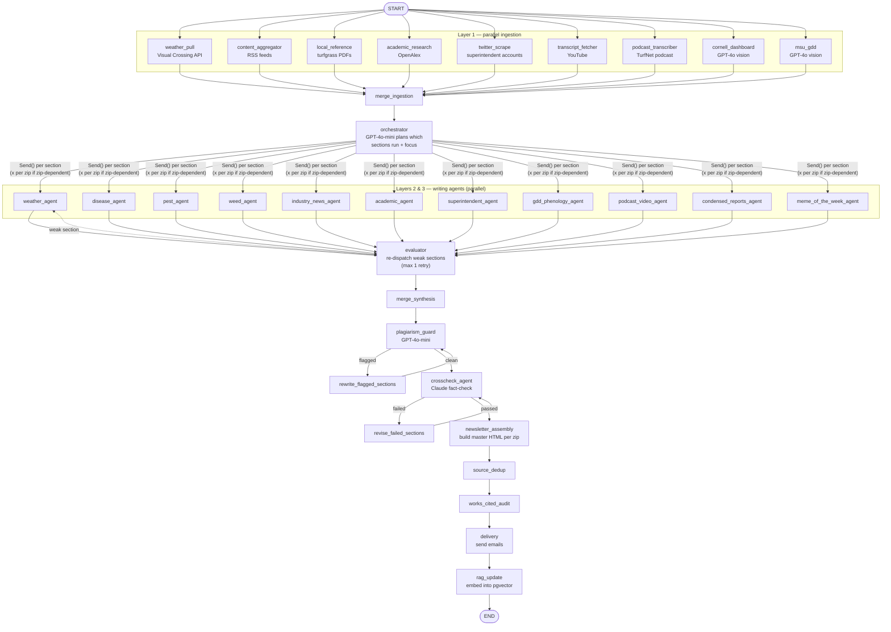

# Turfgrass Weekly

> This repo documents the system design of a private production codebase. It contains no source code — just the architecture writeup below.

An AI-generated weekly newsletter for golf course superintendents and turf managers. A [LangGraph](https://langchain-ai.github.io/langgraph/) pipeline ingests weather data, disease/pest risk dashboards, academic research, industry news, and social content; routes it to parallel GPT-4o writing agents; fact-checks and deduplicates the result; assembles a personalized (per-ZIP) HTML newsletter; and delivers it by email.

A companion FastAPI app (`web.py`) handles subscriber signup/unsubscribe, feedback collection, and serves a React admin dashboard.

## Architecture

The pipeline (`pipeline.py`) is a LangGraph `StateGraph` over one shared `NewsletterState` (`state.py`), passed by reference through every node. Six layers, each implemented in `nodes/`:



`rag_update` embeds the finished newsletter, reviewer/subscriber feedback signal, disease/pest trends, and academic papers into pgvector tables that future runs' agents query for grounding (`db.rag_search_*`).

### How a section gets written

Every writing agent in Layers 2/3 (`nodes/layer2_agents.py`, `nodes/layer3_synthesis.py`) follows roughly the same shape:

1. Pull whatever deterministic source data exists for its section (an MSU GDD Tracker article, a Cornell risk-dashboard extract, the weather API's `weather_raw`, or a bucket of routed articles).
2. If there's real, structured data to report and no synthesis is actually needed, render it straight to HTML — no LLM call. `weed_agent_node` and `pest_agent_node` do this: the MSU weed/insect watch models are just active/not-active states, so there's nothing for GPT to add.
3. Otherwise, call GPT-4o with a section-specific prompt (`prompts.py`) built from that source data, prior reviewer/subscriber feedback (`db.get_reviewer_feedback`, `db.get_subscriber_feedback_summary`), and RAG context pulled from past issues (`db.rag_search_newsletter_archive`).
4. Run the result through `agent_crosscheck` (`nodes/agent_crosscheck.py`) — a Claude-based fact-checker that strips or corrects claims not grounded in the section's own cited sources.
5. Save via `db.upsert_section(week_of, section_name, html, agent_name, zip=...)`.

### Content routing

`nodes/content_routing.py` sorts each week's scraped articles into buckets by source/type, deterministically (no LLM call):

| Bucket | Rule | Feeds |
|---|---|---|
| `superintendent` | source is a known X/Twitter handle | superintendent_agent |
| `podcast_video` | `content_type` is podcast/youtube/transcript | podcast_video_agent |
| `disease` | source is Cornell Turf Dashboard or Purdue Disease Reports | disease_agent |
| `industry` (default) | everything else | industry_news_agent |

Weather, weed, pest, and GDD phenology don't use this routing at all — they read deterministic per-zip source data directly (MSU GDD Tracker, weather API, Cornell dashboard) rather than a bucket of scraped articles.

### The orchestrator

`orchestrator_node` (`nodes/orchestrator.py`) asks GPT-4o-mini, once per run, which sections have enough real source material to run this week and what angle each agent should take — returning an `orchestrator_plan` dict of `{section: {run, focus, priority, skip_reason}}`. A few sections bypass the LLM's judgment with deterministic overrides, because the orchestrator's prompt only sees article-bucket summaries and has no visibility into non-article data sources:

- `weather` always runs — its content comes from the Visual Crossing API, not scraped articles.
- `pest`, `weed`, and `gdd_phenology` are forced on whenever an MSU GDD Tracker article exists for the week, regardless of what the LLM decided.
- `condensed_reports` and `meme_of_the_week` always run.

`route_from_orchestrator` then turns that plan into actual graph dispatch via LangGraph's `Send()` — one dynamic parallel branch per section the plan approved. Weather/disease/pest/GDD phenology (`ZIP_DEPENDENT_SECTIONS`) fan out **once per unique subscriber zip**, each with a `target_zip` override, so every subscriber gets locally-relevant content instead of everyone getting whichever zip happened to run. Shared/national sections (weed, industry news, academic, podcast/video, superintendent, condensed reports, meme) run once and are reused across all zips.

### Zip-personalization

`newsletter_assembly_node` builds one `master_html` draft per unique subscriber zip, merging that zip's zip-specific sections with the shared/national sections (`db.get_all_sections(week_of, zip=...)`, which unions rows keyed to that zip with rows keyed to `zip=''`).

### Quality gates

Two tiers of fact-checking run in this pipeline:

- **Per-agent crosscheck** — most writing agents call `agent_crosscheck` directly on their own output before saving it (see "How a section gets written" above).
- **Layer 4 gates**, over the assembled section HTML for `weather`, `disease`, `pest`, `industry_news`, and `condensed_reports` (`nodes/layer4_quality.py`):
  - **Plagiarism guard** (GPT-4o-mini) — flags copied phrasing, retries the section's writer with a rewrite instruction (max 2 retries), then re-checks.
  - **Crosscheck agent** (Claude) — re-runs the hardened `agent_crosscheck` against each section, revising or flagging for human review on repeated failure (max 2 retries).
- **Works cited audit** (`works_cited_audit_node`) — drops any works-cited entry whose URL isn't actually referenced in that draft's body.
- **Source dedup** (`source_dedup_node`) — removes duplicate URLs from the works-cited list by normalized URL.

## Repo layout

```
pipeline.py              LangGraph graph definition + entry point (run_pipeline)
state.py                 NewsletterState TypedDict — the single source of truth passed between nodes
nodes/
  layer1_ingestion.py     Scrapers: weather, RSS, OpenAlex, Twitter, YouTube, podcasts,
                          Cornell Turf Dashboard & MSU GDD Tracker (GPT-4o vision)
  content_routing.py      Deterministic article routing (no LLM) into sections
  orchestrator.py          Decides which sections run + fan-out/re-dispatch logic (Send())
  layer2_agents.py         Weather / disease / pest writing agents
  layer3_synthesis.py      Weed / industry news / academic / superintendent /
                          GDD phenology / podcast-video / condensed reports / meme agents
  agent_crosscheck.py      Claude-based fact-checking used by layer4 and section agents directly
  layer4_quality.py        Plagiarism guard + crosscheck orchestration (assembled-HTML level)
  layer6_delivery.py       Newsletter assembly, source dedup, works-cited audit,
                          email delivery, RAG indexing
prompts.py                All GPT/Claude prompt templates, one function per section
db.py                     Postgres (Supabase, pgvector) access layer — subscribers, articles,
                          sections, drafts, RAG tables, feedback
charts.py                 GDD comparison chart + NWS forecast widget rendering (rasterized to PNG for email)
web.py                    FastAPI app: subscribe/unsubscribe, feedback form, admin API
frontend/                 React + TypeScript admin dashboard (Vite)
  src/pages/               Dashboard, Newsletters, NewsletterDetail, Subscribers, Login
data/                      Static reference data (e.g. fungicide/herbicide efficacy tables)
guides/                    Reference PDFs used by local_reference_node
```

## Running it

### Prerequisites

- Python 3.11+, Node 18+ (for the frontend)
- A Postgres database with the `pgvector` extension (Supabase recommended)
- API keys: OpenAI, Anthropic, Visual Crossing (weather), NOAA CDO, Twitter, YouTube, Gmail (delivery), Imgflip (meme generator)

Copy `.env` and fill in (see `db.py`/`web.py`/`nodes/layer1_ingestion.py` for exact key names):

```
DATABASE_URL, OPENAI_API_KEY, ANTHROPIC_API_KEY, VISUAL_CROSSING_API_KEY,
NOAA_CDO_TOKEN, TWITTER_BEARER_TOKEN, YOUTUBE_API_KEY, TRANSCRIPT_SERVICE_URL,
GMAIL_USER, GMAIL_APP_PASSWORD, ADMIN_EMAIL, ADMIN_API_KEY,
HITL_BASE_URL, IMGFLIP_USERNAME, IMGFLIP_PASSWORD
```

`HITL_BASE_URL` is a legacy name for the deployed web app's public base URL — used for unsubscribe links, feedback links, and guide-PDF citation links, not any review/approval flow.

### Install

```bash
pip install -r requirements.txt          # full dev install
# or, matching production split:
pip install -r requirements-web.txt      # web.py only
pip install -r requirements-pipeline.txt # pipeline.py only (adds playwright, youtube-transcript-api)
playwright install chromium --with-deps  # needed for Cornell/MSU dashboard scraping
```

### Run the pipeline

```bash
python pipeline.py
```

Runs for the current week by default, generating and delivering in one shot. `run_pipeline()` also accepts `week_of`, `target_email`, `target_zip` for scoped/manual runs.

### Run the web app

```bash
uvicorn web:app --reload
```

### Run the admin frontend

```bash
cd frontend && npm install && npm run dev
```

## Deployment

Two Railway services, deployed separately:

- **Web app** (`web.py`) — `railway.toml`; `uvicorn web:app`.
- **Pipeline** (`pipeline.py`) — `railway-pipeline.toml`, run as a weekly cron job (`0 10 * * 1`, Mondays 10:00 UTC) via `nixpacks`, installing `ffmpeg`/`poppler-utils` for transcript/PDF processing and Playwright's Chromium for dashboard scraping.

`railway-delivery.toml` defines a separate delivery-only cron job (`0 9 * * 1`) intended to send an already-generated draft without re-running the full pipeline — note its `startCommand` currently points at `send_scheduled_newsletter.py`, which is not present in this repo; that script needs to be restored or the config updated before that service can run.
